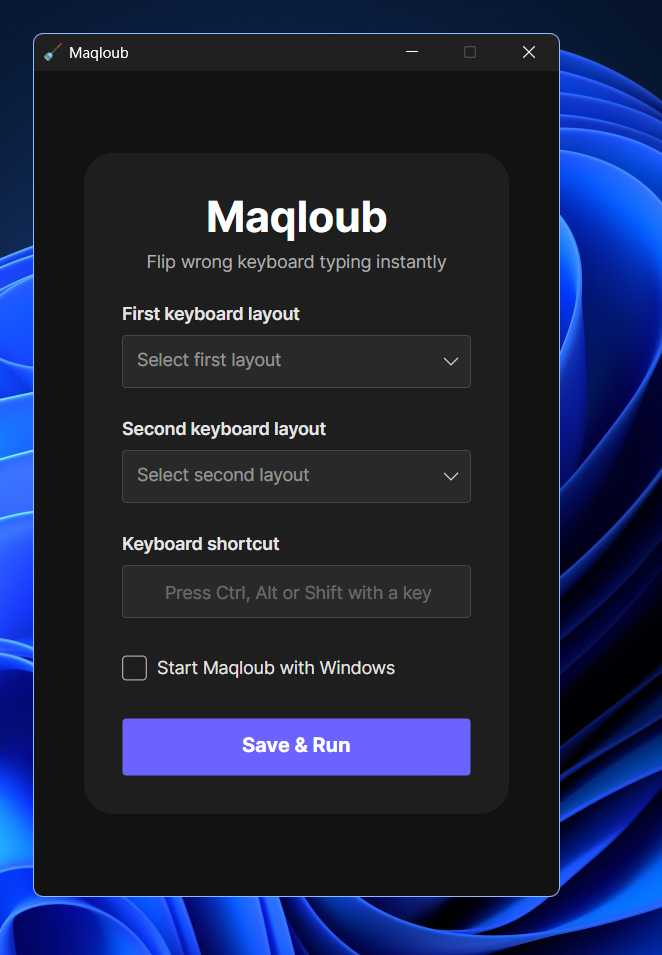
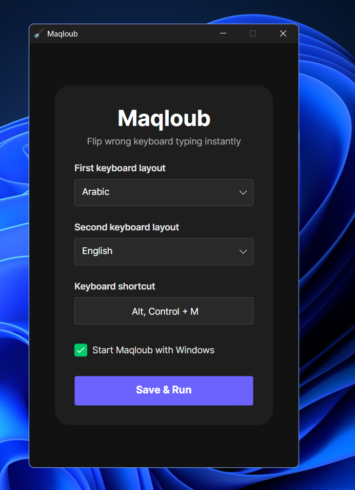
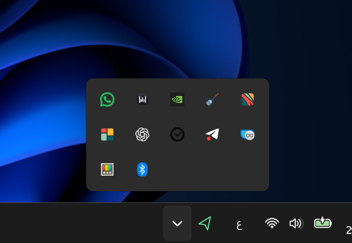

<p align="center">
  
</p>

# Maqloub

**Fix text typed with the wrong Arabic or English keyboard layout—without retyping it.**

Maqloub is a Windows desktop utility that converts selected text between Arabic and English keyboard mappings using a shortcut you choose. Configure it once, keep it in the system tray, and use it in an editable text field that supports copying and pasting.

كتبت نصًا بلوحة المفاتيح الخطأ؟ حدّد النص واضغط اختصار Maqloub لتحويله بين تخطيطي العربية والإنجليزية دون إعادة كتابته.

The application is named **Maqloub**; this repository is **MaqloubDesktop**.

[Features](#features) · [How it works](#how-it-works) · [Installation](#installation) · [Screenshots](#screenshots) · [Current support](#current-support) · [Roadmap](#roadmap)

## Features

- **Arabic ↔ English conversion:** remap characters according to their keyboard positions.
- **Configurable global shortcut:** choose a modifier combination with a letter or number key.
- **System tray access:** reopen the window, access settings, reset configuration, or fully exit.
- **Saved preferences:** retain the selected layouts, shortcut, and startup preference locally.
- **Optional Windows startup:** enable “Start Maqloub with Windows” from the settings window.
- **Background operation:** “Save & Run” hides the window; closing it also leaves Maqloub running in the tray.

## How it works

1. Open Maqloub and select **Arabic** and **English** as the two layouts, in either order.
2. Focus the **Keyboard shortcut** field and press a combination such as **Ctrl + Alt + M**. If it is unavailable, choose another combination.
3. Optionally enable **Start Maqloub with Windows**, then click **Save & Run**.
4. In another application, select the text you want to correct in an editable field.
5. Press your shortcut and release the keys. Maqloub copies the selection, converts the characters, and pastes the result over the selection.

For example, typing `sghl` with the English layout produces **سلام** after conversion. Converting **سلام** back produces `sghl`.

This is keyboard-layout correction, not translation. The converter chooses Arabic-to-English when the selection contains a character in the Arabic Unicode block; otherwise, it chooses English-to-Arabic. Characters outside the mapping are kept as they are.

During a successful conversion, Maqloub temporarily uses the clipboard and attempts to restore its previous **plain-text** content. Other clipboard formats are not preserved. See [Current support](#current-support) for limitations.

Use the tray menu's **Open Maqloub** or **Settings** entry to reopen the configuration window. **Reset Settings** clears the saved configuration, unregisters the shortcut, and disables Windows startup. To stop the app completely, choose **Final exit**.

## Technologies

The versions below reflect the current [project file](Maqloub.csproj).

| Technology | Use |
| --- | --- |
| C# / .NET 10 (`net10.0`) | Application and conversion logic |
| Avalonia UI 12.1.1 | Desktop window, controls, and tray integration |
| Avalonia Fluent theme and Inter font | UI styling and typography |
| CommunityToolkit.Mvvm 8.4.2 | View-model infrastructure |
| Win32 APIs (`user32.dll`) | Global hotkey registration and simulated copy/paste |
| System.Text.Json | Local settings serialization |
| Windows Registry | Optional startup registration for the current user |

## Installation

### Build and run from source

Prerequisites:

- Windows for the currently implemented desktop workflow.
- The **.NET 10 SDK**.
- Git and access to this repository.
- Internet access for the initial NuGet package restore.

Run the following in a terminal:

```powershell
git clone https://github.com/devSeyf/MaqloubDesktop.git
cd MaqloubDesktop
dotnet restore Maqloub.csproj
dotnet build Maqloub.csproj -c Release --no-restore
dotnet run --project Maqloub.csproj -c Release --no-build
```

If settings have already been saved, Maqloub may open directly in the background. Use its tray icon to reopen the window.

### Create a local Windows x64 build

To produce a self-contained build for a 64-bit Windows PC:

```powershell
dotnet publish Maqloub.csproj -c Release -r win-x64 --self-contained true -o artifacts/publish/win-x64
```

Open `artifacts/publish/win-x64/Maqloub.exe`. Keep the entire published folder together.

For Windows startup, place the published folder in its intended location and run that executable before enabling **Start Maqloub with Windows**. The startup entry records the running executable's path; if you move it, update the setting from the executable in its new location.

Settings are stored at `%APPDATA%\Maqloub\settings.json`.

## Screenshots

### Main window and settings

| Main window | Configured layouts and shortcut |
| --- | --- |
|  |  |

### System tray

Maqloub's spatula icon appears in the Windows system tray.



### Before and after

An example of correcting text typed with the wrong keyboard layout.

**Before correction**


**After correction**


## Current support

This describes the implementation in the repository, not a tested compatibility matrix.

| Area | Current scope |
| --- | --- |
| Platform | Windows integration is implemented. macOS and Linux global hotkeys, copy/paste automation, and startup are not implemented. |
| Layouts | Arabic and English only, using the fixed mapping in [KeyboardLayoutConverter](Services/KeyboardLayoutConverter.cs). |
| Shortcut keys | Letters A–Z or top-row digits 0–9 with one or more modifiers (Ctrl, Alt, Shift, or Windows). Function keys and other key types are not mapped by the current hotkey service. |
| Target applications | Editable fields that respond to standard Ctrl+C and Ctrl+V; compatibility can vary by application. |
| Clipboard | Plain text only; images, files, and rich-text formats are not restored. If no previous text was saved, the converted text can remain on the clipboard. |
| Mixed text | Direction is chosen for the entire selection. Mixed Arabic/English text is not converted independently by segment. |
| Mapping limits | English letters are normalized to lowercase for lookup. There is no complete shifted-key mapping; unmapped characters remain unchanged. |

Always select the text before using the shortcut. The current flow reads the clipboard after sending Ctrl+C and does not verify that the selection was copied successfully.

## Project structure

```text
MaqloubDesktop/
├── Assets/              # Existing application icons and images
├── Models/              # Settings model
├── Services/            # Conversion, clipboard, hotkeys, settings, and startup
├── ViewModels/          # View-model infrastructure
├── Views/               # Main window markup and interaction logic
├── docs/images/         # Real screenshots and capture guide
├── App.axaml            # Application styling and tray menu
├── App.axaml.cs         # Application lifetime and tray actions
├── Program.cs           # Desktop entry point
├── Maqloub.csproj       # Target framework and package references
└── Maqloub.slnx          # Solution
```

## Roadmap

Proposed next steps for future development; these are not shipped features or release commitments.

- [x] Add real screenshots of the main window and example configuration.
- [x] Show a before-and-after conversion example.
- [ ] Provide a packaged Windows release with clear installation instructions.
- [ ] Add automated coverage for conversion mappings and mixed-text edge cases.
- [ ] Improve copy/paste failure handling and clipboard preservation.
- [ ] Expand layout and shortcut-key support.
- [ ] Investigate the platform-specific work needed for macOS and Linux.

Report reproducible problems or suggest improvements through this repository's [Issues](https://github.com/devSeyf/MaqloubDesktop/issues).
